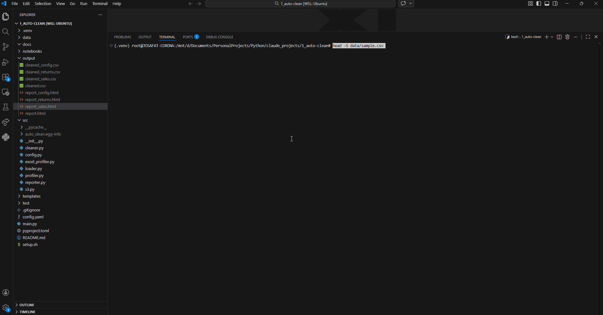

# 🧹 auto-clean

> Stop cleaning data by hand. auto-clean does it in seconds.



**auto-clean** is a command-line tool that cleans messy CSV, Excel, and TXT files automatically and generates a visual HTML report — no manual work required.

Point it at a file, run one command, get clean data.

---

## ✨ Features

- **Multi-format support:** CSV, Excel (`.xlsx`, `.xls`), and TXT files with auto-detected delimiters
- **Excel intelligence:**
  - Scans all sheets before touching anything
  - Detects where the real header row is (even when there are titles or blank rows above)
  - Interactive sheet selection in the terminal
  - Process one sheet or all sheets at once
- **Automated cleaning:**
  - Remove duplicate rows
  - Fill missing values — strategies: `mean`, `median`, `mode`, `drop`
  - Detect and remove outliers — methods: `iqr`, `zscore`
  - Standardize column names (`Annual Salary` → `annual_salary`)
- **HTML report** with cleaning summary, column analysis, null counts, and renamed columns
- **S3 support** via Jupyter notebook — browse your bucket, pick a file, clean it, upload results back
- **Zero config required** — one `config.yaml` controls everything

---

## 📂 Project Structure

```text
auto-clean/
├── main.py                  # CLI entry point
├── config.yaml              # user configuration
├── setup.sh                 # one-command environment setup
├── pyproject.toml           # dependencies
├── src/
│   ├── cleaner.py           # cleaning logic
│   ├── config.py            # config loader
│   ├── excel_profiler.py    # Excel structure detection
│   ├── loader.py            # multi-format file loader
│   ├── profiler.py          # data profiling
│   ├── reporter.py          # HTML report generator
│   └── s3.py                # S3 download / upload helpers
├── notebooks/
│   └── s3_loader.ipynb      # interactive S3 workflow
├── templates/
│   └── report.html          # Jinja2 report template
├── data/                    # put your input files here
└── output/                  # cleaned CSV and HTML report land here
```

---

## 🛠️ Installation

Requires Python 3.10+ and [uv](https://github.com/astral-sh/uv).

```bash
git clone https://github.com/josafatcorona/auto-clean.git
cd auto-clean
source setup.sh
```

That is it. The script creates the virtual environment and installs all dependencies automatically.

To activate the environment in future sessions:

```bash
source .venv/bin/activate
```

---

## ⚙️ Configuration (`config.yaml`)

```yaml
input:
  file_path: "data/sample.csv"   # default file, overridden by --file flag
  encoding: "utf-8"               # options: utf-8, cp1252, latin-1
  separator: ","                  # used for CSV and TXT only

cleaning:
  remove_duplicates: true
  fill_nulls: true
  fill_strategy: "mean"           # options: mean, median, mode, drop
  remove_outliers: true
  outlier_method: "iqr"           # options: iqr, zscore
  fix_column_names: true

output:
  folder: "output"
  save_cleaned_csv: true
  generate_report: true
```

---

## ▶️ Usage

### CSV and TXT

```bash
# Uses file_path from config.yaml
python main.py

# Override with any local file
python main.py --file data/sales.csv
python main.py --file data/report.txt
```

### Excel — interactive mode

```bash
python main.py --file data/report.xlsx
```

auto-clean scans the file first and shows you its structure:

```
📊 Excel Structure Report
   File: data/report.xlsx
   Sheets found: 3

╭──────────┬──────┬─────────┬──────────────┬──────────────────────────╮
│ Sheet    │ Rows │ Columns │ Header at row│ Sample columns           │
├──────────┼──────┼─────────┼──────────────┼──────────────────────────┤
│ Sales    │ 1240 │       8 │            0 │ date, amount, region ... │
│ Returns  │   89 │       5 │            2 │ order_id, amount ...     │
│ Config   │    5 │       2 │            0 │ key, value          ⚠ metadata │
╰──────────┴──────┴─────────┴──────────────┴──────────────────────────╯

Which sheet do you want to clean?
  1. Sales
  2. Returns
  3. Config
  4. All sheets

Enter number:
```

### Excel — non-interactive flags

```bash
# Process a specific sheet directly
python main.py --file data/report.xlsx --sheet Sales

# Process all sheets at once (one report per sheet)
python main.py --file data/report.xlsx --all-sheets
```

### Example terminal output

```
🧹 auto-clean starting...

✓ Loaded: 1240 rows × 8 columns

  Cleaning Summary — Sales
  ┌────────────────────┬────────┐
  │ Action             │ Result │
  ├────────────────────┼────────┤
  │ Duplicates removed │     12 │
  │ Nulls filled       │     34 │
  │ Outliers removed   │      6 │
  │ Rows before        │   1240 │
  │ Rows after         │   1222 │
  └────────────────────┴────────┘

✓ Saved CSV:  output/cleaned_sales.csv
✓ Report:     output/report_sales.html

✅ Done.
```

---

## ☁️ S3 Workflow (Jupyter Notebook)

For files stored in AWS S3, use the included notebook:

```bash
jupyter lab
# open notebooks/s3_loader.ipynb
```

The notebook lets you:

1. List all supported files in your bucket interactively
2. Pick a file by number
3. Download it automatically to a temp folder
4. Run the full auto-clean pipeline on it
5. Optionally upload the cleaned CSV back to S3

Authentication is handled automatically via IAM roles (EC2) or environment variables — no hardcoded credentials.

```python
# Set these two lines in the notebook config cell:
BUCKET = "your-bucket-name"
PREFIX = "raw/2025/"          # optional folder filter
```

---

## 📊 Report Example

The HTML report includes:

- **Summary cards:** original rows, clean rows, duplicates removed, nulls filled, outliers removed
- **Column analysis table:** name, data type, null count, null percentage, unique values, sample values
- **Renamed columns table:** shows every column that was standardized

---

## 💡 Why I built this

Every data project starts the same way: load a CSV and spend the first hour fixing column names, hunting for nulls, and removing duplicates. Multiply that by dozens of client files per month and it becomes a significant time sink.

auto-clean automates that first hour so you can focus on the analysis that actually matters. It handles CSV, Excel — including the messy real-world kind with titles above the header — and TXT files, and it works the same way whether your data lives locally or in S3.

---

## 🤝 Contributing

Issues and pull requests are welcome. If you find a file format or encoding that breaks the tool, open an issue with a sample file and I will add support for it.